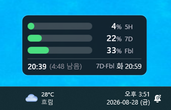

# ClaudeWidget

Windows 11용 초소형 always-on-top Claude 사용량 위젯. .NET 10 / WPF, 외부 의존성 없음.

<p align="center"></p>

| 행 | 의미 |
| --- | --- |
| `5H` | 5시간 세션 사용량 |
| `7D` | 주간 전체 사용량 |
| `Fbl` | 모델 한정 주간 사용량 (Fable) |
| 하단 | 5H 리셋 시각 · 남은 시간 · 주간 리셋 요일/시각 (`7D·Fbl 화 21:00`) |

## 다운로드

[Releases](https://github.com/Xojong/ClaudeWidget/releases)에서 단일 exe를 받습니다. 기능은 동일합니다.

| 빌드 | 크기 | 요구사항 |
| --- | --- | --- |
| `framework-dependent` | 0.24 MB | .NET 10 Desktop Runtime |
| `self-contained` | 66 MB | 없음 |

## 조작

| 조작 | 동작 |
| --- | --- |
| 드래그 | 위치 이동 (자동 저장) |
| `Ctrl` + 휠 | 크기 50%~200% |
| 우클릭 / `⋯` | 메뉴 |
| 트레이 아이콘 좌클릭 | 화면 밖 위젯 회수 |

메뉴: 새로고침 주기(1~5분) · 크기 · 투명도 · 표시 항목 · 언어(한국어/English) · 항상 위 · 위치 잠금 · 시작 프로그램 · 정보

- 투명도는 배경에만 적용됩니다. 숫자와 게이지는 항상 선명합니다.
- 언어는 재시작 없이 즉시 바뀝니다.
- 마우스를 올리면 데이터 기준 시각이 툴팁으로 나옵니다.

### 크기

| 설정 | 크기 (96 DPI) |
| --- | --- |
| 100% | 129 × 81 px |
| 75%, 라벨 끔 | 77 × 61 px |
| 50%, 라벨 끔 | 52 × 40 px |

50%에서는 라벨이 뭉개지므로 메뉴 → 표시 → 라벨을 끄는 편이 낫습니다. 읽기 편한 최소치는 75% + 라벨 끔.

## 데이터 소스

**로컬 기록이 우선, API는 폴백**입니다.

1. `%USERPROFILE%\.claude\usage-history.jsonl` — 외부 사용량 로거가 남기는 파일. 3분 이내 기록이면 그대로 씁니다. (파일이 없어도 정상 동작)
2. `GET https://api.anthropic.com/api/oauth/usage` — 로컬 기록이 없거나 3분 넘게 끊겼을 때만.

둘 다 실패하면 마지막 값을 흐리게 유지합니다.

**로컬 우선인 이유** — 이 엔드포인트는 토큰 단위로 레이트 리밋이 걸립니다. 로거가 이미 쿼터를 쓰고 있다면 위젯이 폴링을 하나 더 얹는 순간 429가 시작되고, 로거까지 함께 차단됩니다.

### API 폴백 시 방어 장치

- 실제 호출은 최소 20초 간격 (연타는 캐시로 응답)
- 429 → `Retry-After`만큼, 없거나 0이면 1분 중단
- 연속 실패 시 폴링 간격 1x → 2x → 4x → 8x 백오프

### 응답 파싱

- 모델별 사용량은 `limits[]`에만 있습니다. 최상위 `seven_day_opus` 등은 항상 `null`.
- `kind`: `session`(5시간) · `weekly_all`(주간 전체) · `weekly_scoped`(모델 한정, `scope.model.display_name`으로 구분)
- 로컬 기록의 값은 분수(0.45), API는 백분율(45.0).

## 토큰

읽기만 합니다. `CLAUDE_CODE_OAUTH_TOKEN` 환경변수 → `%USERPROFILE%\.claude\.credentials.json` 순서로 찾습니다.

**위젯은 토큰을 재발급하지 않습니다.** refresh token은 1회용이고 CLI와 공유되므로, 두 프로그램이 재발급을 시도하면 토큰 계열 전체가 무효화됩니다. 만료되면 리셋 시각 자리에 **"Claude Code 로그인 필요"**를 띄우고, Claude Code에서 로그인하면 다음 폴링에서 자동 복구됩니다.

## 진단

```powershell
ClaudeWidget.exe --probe   # 토큰 상태 · 로컬 기록 신선도 · 파싱된 값 출력
ClaudeWidget.exe --demo    # API 호출 없이 예시 수치로 렌더링 (실제 위젯과 동시 실행 가능)
```

## 빌드

```powershell
dotnet run --project src\ClaudeWidget

# 런타임 의존
dotnet publish src\ClaudeWidget\ClaudeWidget.csproj -c Release -r win-x64 `
  -p:SelfContained=false -p:PublishSingleFile=true -p:DebugType=none `
  -o publish\framework-dependent

# 독립 실행
dotnet publish src\ClaudeWidget\ClaudeWidget.csproj -c Release -r win-x64 `
  -p:SelfContained=true -p:PublishSingleFile=true `
  -p:IncludeNativeLibrariesForSelfExtract=true -p:DebugType=none `
  -o publish\self-contained
```

- `--self-contained false`는 무시될 수 있습니다. 반드시 `-p:SelfContained=false`.
- 독립 실행 빌드는 `EnableCompressionInSingleFile`로 압축됩니다 (시작이 조금 느림).
- `PublishTrimmed` / NativeAOT는 WPF 미지원.
- 버전은 csproj의 `<Version>` 하나만 올리면 정보 창과 exe 속성에 반영됩니다.

## 구조

```
src/ClaudeWidget/
├─ Models/                    API DTO · 정규화된 3버킷
├─ Services/
│  ├─ UsageProvider.cs        출처 결정 (로컬 → API)
│  ├─ UsageHistoryReader.cs   usage-history.jsonl 읽기
│  ├─ UsageClient.cs          OAuth API · 스로틀 · 429
│  ├─ CredentialStore.cs      토큰 읽기 (읽기 전용)
│  ├─ SettingsStore.cs        설정 · 시작 프로그램
│  └─ Strings.cs              한국어/영어 UI 텍스트
├─ Controls/BarGauge.cs       막대 게이지
├─ ViewModels/MainViewModel.cs
├─ MainWindow.xaml            위젯 창 · 메뉴
└─ AboutWindow.xaml           정보 창
```

설정 파일: `%APPDATA%\ClaudeWidget\settings.json`

## 알려진 제약

투명 WPF 창은 ClearType이 꺼져 아주 작은 글자가 약간 부드럽게 보입니다. `Segoe UI Variable Small`과 tabular figures로 보완했습니다.
